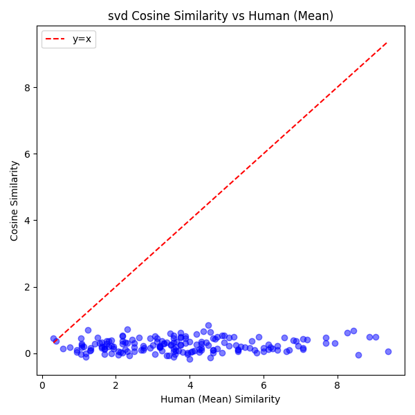
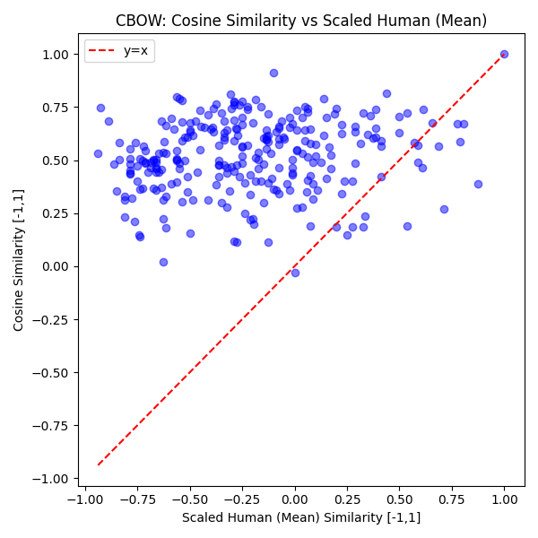
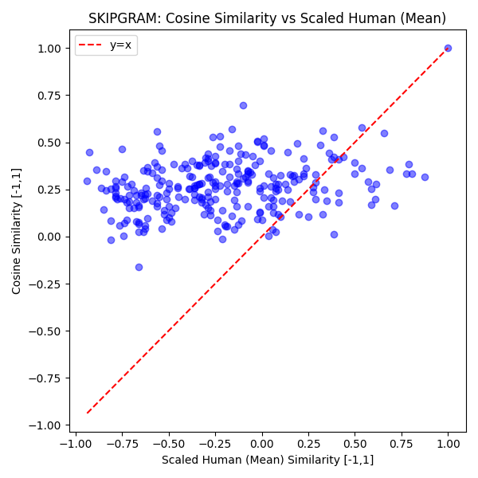

# Report: Comparison of SVD, CBOW, and Skip-Gram on the WordSim Task

## 1. Introduction

This report compares and analyzes the performance of three static word embedding techniques—SVD-based embeddings, CBOW, and Skip-Gram—using the WordSim-353 dataset. 
 
In this task, cosine similarities between pairs of word embeddings are compared against human-annotated similarity scores. We evaluate each method using Spearman's Rank Correlation, which measures the degree of monotonic agreement between the model predictions and human judgments.

---

## 2. Methodology

### 2.1 SVD-based Embeddings

SVD-based embeddings are computed by constructing a word co-occurrence matrix from the Brown corpus and then applying truncated Singular Value Decomposition (SVD). 

- **Benefits:**
  - Captures global co-occurrence statistics.
  - Often more interpretable.
  
- **Limitations:**
  - Requires building and processing a large co-occurrence matrix.
  - Sensitive to choices like vocabulary size and window size.

*In our implementation, we limit the vocabulary to the top 5000 words (after lowercasing) to ensure a manageable matrix size.*

### 2.2 CBOW (Continuous Bag-of-Words)

The CBOW model predicts a target word based on its surrounding context words. It uses a neural network with an embedding layer and applies negative sampling during training.

- **Benefits:**
  - Computationally efficient.
  - Can capture syntactic patterns effectively.
  
- **Limitations:**
  - Averaging context embeddings may dilute finer semantic nuances.
  - Performance may be affected if the vocabulary is filtered too aggressively.

*Our CBOW model is trained on the Brown corpus with a minimum frequency threshold (min_count=5), and we save the learned embeddings along with the vocabulary.*

### 2.3 Skip-Gram

The Skip-Gram model uses a target word to predict its surrounding context words. This method generally produces high-quality embeddings, particularly for semantic similarity tasks.

- **Benefits:**
  - Typically yields high-quality embeddings for semantic tasks.
  - Focuses on capturing the context around each word.
  
- **Limitations:**
  - More computationally expensive compared to CBOW due to more training samples per sentence.
  - Sensitive to hyperparameter choices (e.g., window size, negative sampling rate).

*Like CBOW, the Skip-Gram model is trained on the Brown corpus (min_count=5) and saves both embeddings and vocabulary.*

---

## 4. Results

### 4.1 Cosine Similarity vs Human (Mean)

The following plots show the relationship between the cosine similarities (computed from the embeddings) and the human similarity scores:

- **SVD:**

  

- **CBOW:**

  

- **Skip-Gram:**

  

### 4.2 Spearman's Rank Correlation Comparison

The overall performance on the WordSim-353 task is summarized by Spearman's Rank Correlation. The following bar chart compares the correlations achieved by each method:

---

**Limitations:**
- The performance of each method is influenced by the size and quality of the training corpus, hyperparameter choices, and preprocessing steps.
- SVD is computationally expensive when scaling to larger vocabularies.
- Neural methods (CBOW and Skip-Gram) depend heavily on negative sampling and might not capture rare words as effectively if they are filtered out by the minimum frequency threshold. But if used without negative sampling, they can be very computationally expensive.

---