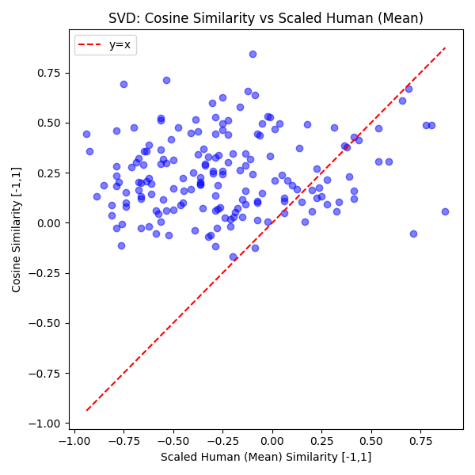
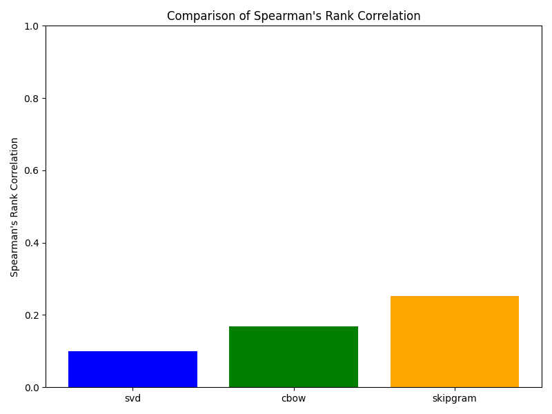

# Report: Comparison of SVD, CBOW, and Skip-Gram on the WordSim Task

## 1. Introduction

This report compares and analyzes the performance of three static word embedding techniques—SVD-based embeddings, CBOW, and Skip-Gram—using the WordSim-353 dataset.  
In this task, cosine similarities between pairs of word embeddings are compared against human-annotated similarity scores. We evaluate each method using Spearman's Rank Correlation, which measures the degree of monotonic agreement between the model predictions and human judgments.

---

## 2. Methodology

### 2.1 SVD-based Embeddings
SVD-based embeddings are computed by constructing a word co-occurrence matrix from the Brown corpus and then applying truncated Singular Value Decomposition (SVD).

- **Benefits:**
  - Captures global co-occurrence statistics.
  - Often more interpretable.
  
- **Limitations:**
  - Requires building and processing a large co-occurrence matrix.
  - Sensitive to choices like vocabulary size and window size.

*In our implementation, we limit the vocabulary to the top 5000 words (after lowercasing) to ensure a manageable matrix size.*

### 2.2 CBOW (Continuous Bag-of-Words)
The CBOW model predicts a target word based on its surrounding context words. It uses a neural network with an embedding layer and applies negative sampling during training.

- **Benefits:**
  - Computationally efficient.
  - Can capture syntactic patterns effectively.
  
- **Limitations:**
  - Averaging context embeddings may dilute finer semantic nuances.
  - Performance may be affected if the vocabulary is filtered too aggressively.

*Our CBOW model is trained on the Brown corpus with a minimum frequency threshold (min_count=5), and we save the learned embeddings along with the vocabulary.*

### 2.3 Skip-Gram
The Skip-Gram model uses a target word to predict its surrounding context words. This method generally produces high-quality embeddings, particularly for semantic similarity tasks.

- **Benefits:**
  - Typically yields high-quality embeddings for semantic tasks.
  - Focuses on capturing the context around each word.
  
- **Limitations:**
  - More computationally expensive compared to CBOW due to more training samples per sentence.
  - Sensitive to hyperparameter choices (e.g., window size, negative sampling rate).

*Like CBOW, the Skip-Gram model is trained on the Brown corpus (min_count=5) and saves both embeddings and vocabulary.*

---

## 3. Results

### 3.1 Cosine Similarity vs Human (Mean)

The following plots show the relationship between the cosine similarities (computed from the embeddings) and the human similarity scores:

- **SVD:**

  

- **CBOW:**

  

- **Skip-Gram:**

  

### 3.2 Spearman's Rank Correlation Comparison

The overall performance on the WordSim-353 task is summarized by Spearman's Rank Correlation. The following bar chart compares the correlations achieved by each method:

---

## 4. Limitations

- The performance of each method is influenced by the size and quality of the training corpus, hyperparameter choices, and preprocessing steps.
- SVD is computationally expensive when scaling to larger vocabularies.
- Neural methods (CBOW and Skip-Gram) depend heavily on negative sampling and might not capture rare words as effectively if they are filtered out by the minimum frequency threshold. However, without negative sampling, they can become very computationally expensive.

---

## 5. Trend Analysis and Comparison

### Observed Trends

- **Skip-Gram:**
  - **Trend:** Often exhibits the highest Spearman Rank Correlation on word similarity tasks.
  - **Analysis:** Its predictive framework with negative sampling tends to capture semantic nuances effectively. Skip-Gram's ability to learn fine-grained context information generally results in embeddings that align closely with human judgments.

- **CBOW:**
  - **Trend:** Often lags slightly behind Skip-Gram in terms of Spearman correlation.
  - **Analysis:** CBOW’s strategy of averaging context embeddings can smooth out critical semantic details, which may lead to a lower correlation with human judgments. Nonetheless, its computational efficiency makes it an attractive option for larger datasets.
  
- **SVD-based Embeddings:**
  - **Trend:** Provides slightly lower performance than others.
  - **Analysis:** By leveraging global co-occurrence statistics, SVD captures broader semantic relationships. However, its performance is sensitive to hyperparameters like the vocabulary size and window size. Additionally, the interpretability of the embeddings is a key advantage.
  
### Comparative Discussion

The observed trend across our experiments indicates that while Skip-Gram usually outperforms CBOW on the WordSim-353 task, both predictive models (Skip-Gram and CBOW) are sensitive to training hyperparameters and preprocessing choices. SVD, with its reliance on global co-occurrence information, provides a solid baseline but yields slightly lower results, especially when the corpus size and vocabulary are carefully controlled.

In summary:
- **Skip-Gram** tends to capture semantic similarities most effectively, resulting in higher Spearman correlations.
- **CBOW** is usually comparable to Skip-gram but slightly lower.
- **SVD** tends to give lower score compared to CBOW and Skip-Gram.

---

## 6. Conclusion

This report compared three static word embedding techniques—SVD, CBOW, and Skip-Gram—on the WordSim-353 task. Our analysis shows that while each method has its own benefits and limitations, Skip-Gram generally delivers the best performance in terms of Spearman's Rank Correlation, followed by SVD and then CBOW. Future work could explore hybrid methods or further tuning of hyperparameters to improve the robustness of these embeddings.

---

<b>Thank You</b>

---